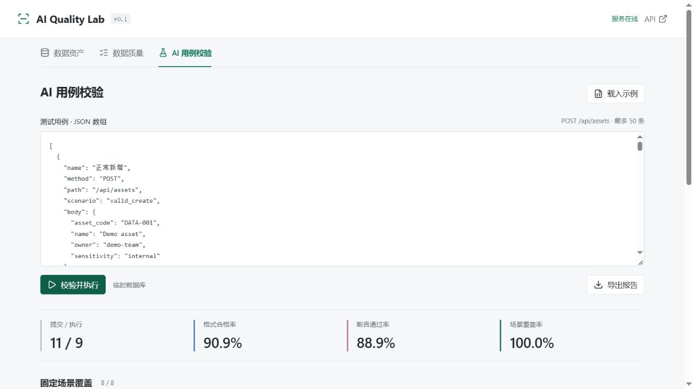

# AI Quality Lab

一个小型、可部署的数据资产与 AI 测试用例校验项目。

**Python + FastAPI + SQLite + pytest，前端为原生 HTML/CSS/JavaScript，无需 Node 构建工具。**

它不是通用 Agent：将大模型生成的 JSON 用例作为不可信输入，先检查结构与允许的接口，再在隔离数据库里执行，最后输出断言结果和固定场景覆盖报告。首版不调用模型、不需要 API Key，示例用例是人工设计的演示数据。



## 功能

- 数据资产新增、查询、编辑、删除；搜索和分页；SQLite 持久化。
- 数据质量检查：缺失字段、空值、长度、格式、枚举、未知字段和重复编码。
- AI 输出校验：结构检查、重复请求识别、错误状态码和响应字段断言。
- 每条用例使用独立临时数据库，不会修改资产目录，也不会访问外部 URL 或执行用户代码。
- 页面导出 JSON 报告；pytest 回归测试；GitHub Actions 测试和 Docker 烟雾测试。

范围刻意保持小：用例执行器仅支持 `POST /api/assets`。其他 CRUD 接口由 pytest 测试，不纳入页面上的固定场景覆盖率。

## 本地启动

需要 Python 3.13。

### Windows PowerShell

在项目根目录执行，无需激活虚拟环境：

```powershell
python -m venv .venv
.\.venv\Scripts\python.exe -m pip install -r requirements-dev.txt
.\.venv\Scripts\python.exe -m uvicorn app.main:app --host 127.0.0.1 --port 8000
```

### Linux / macOS

```bash
python3.13 -m venv .venv
.venv/bin/python -m pip install -r requirements-dev.txt
.venv/bin/python -m uvicorn app.main:app --host 127.0.0.1 --port 8000
```

- 工作区：<http://127.0.0.1:8000>
- Swagger API：<http://127.0.0.1:8000/docs>
- 健康检查：<http://127.0.0.1:8000/health>

端口被占用时，修改 `--port`。首次启动创建空数据库 `data/assets.db`；可通过环境变量 `DATABASE_PATH` 修改位置。默认不预先写入任何资产。

## Docker 部署

```bash
docker compose up --build -d
docker compose logs -f
docker compose down
```

Compose 默认仅绑定本机 `127.0.0.1:8000`，使用命名卷持久化数据库。容器采用非 root 用户运行；`down` 不删除数据卷。

**这是本地教学演示，未实现认证、授权、速率限制和生产审计。不要使用真实人事数据、个人信息或密钥，也不要直接开放到公网。** 需要远程演示时，先配置 HTTPS、访问控制和反向代理；不能把本项目描述为已经具备这些能力。

## 测试

```powershell
.\.venv\Scripts\python.exe -m pytest --junitxml=reports/junit.xml
```

Linux / macOS 将 Python 路径换成 `.venv/bin/python`。

测试覆盖正常 CRUD、边界值、非法输入、重复冲突、持久化、搜索转义、数据质量，以及用例隔离、重复检测、错误断言和错误场景标签等。测试不需要网络或模型服务。

GitHub Actions 在 push / pull request 时运行测试并上传 JUnit 报告，同时构建 Docker 镜像并检查健康接口和数据库写入。配置文件存在不代表远端 CI 已经运行；以仓库 Actions 的实际结果为准。

## 三分钟演示

1. 在“数据资产”新增一项虚构资产，例如 `DATA-001`。
2. 再提交相同编码，查看 `409` 冲突；将名称设置为全空格，查看 `422` 校验失败。
3. 打开“数据质量”，检查内置示例。8 条记录中 2 条合格，6 条有问题。
4. 打开“AI 用例校验”，运行内置示例。11 条提交中：1 条结构拒绝，1 条重复跳过，9 条执行，其中 8 条断言通过、1 条失败。
5. 查看失败用例的预期 / 实际状态码，再导出 JSON 报告。

内置示例中的错误是**故意构造的演示情况**，不是声称某个模型真实生成了这些错误，也不是历史产品缺陷。

## 接入真实 AI 工作流

项目本身不调用模型。使用任意你有权限使用的大模型工具：

1. 将 [接口约定](docs/api-contract.md) 和 [生成提示词](docs/prompt.md) 提供给模型，仅使用虚构数据。
2. 保留模型的原始 JSON 数组输出，粘贴到“AI 用例校验”。
3. 查看被拒绝、重复、失败和场景不匹配项，人工判断错误原因。
4. 修改提示词后重新生成，对比结果；记录模型名称、日期、原始输出和修改内容。

这能展示“AI 生成 → 规则校验 → 隔离执行 → 人工复核”的完整小闭环。没有实际完成上述实验之前，不应宣称已经评估过某模型的准确率。

## 指标口径

| 指标 | 定义 |
| --- | --- |
| 数据记录合格率 | 无校验问题的记录数 / 提交记录数 |
| 用例格式合格率 | 符合用例结构的条数 / 提交条数；重复项仍计为结构合格 |
| 断言通过率 | 状态码与指定响应字段都匹配的用例数 / 实际执行数；未执行时为 `null` |
| 固定场景覆盖率 | 标签与输入匹配且断言通过的不同场景数 / 8 |

重复请求依据请求方法、路径、请求体及是否有重复编码预置数据判断，不依据名称或预期断言。重复项不再次执行，报告保留第一条的断言。

**这些指标不是模型准确率，也不是全部业务覆盖率。** 格式正确不代表语义正确；被测接口和场景匹配器共享字段模型，也存在共同缺陷风险。真实业务需要独立测试预期、人工标注和更广泛场景。

## 项目结构

```text
app/
  main.py          接口和应用工厂
  models.py        资产与用例结构
  db.py            SQLite 连接与表初始化
  quality.py       批量数据质量检查
  evaluation.py    用例校验、隔离执行和指标计算
  static/          网页及本地图标资源
examples/          虚构数据与故意错误的用例
tests/             pytest 测试
docs/              接口约定、AI 提示词、学习任务和验证记录
.github/workflows/ 自动测试与 Docker 烟雾测试
```

## 学习与贡献

三到四天的实践安排见 [实践路线](docs/practice-plan.md)。欢迎通过 issue 报告可复现问题，提交修改时请补充相应测试，不上传真实数据和凭据。

项目包含 AI 辅助开发内容。理解代码、核对测试预期和实际完成模型实验，是使用它作为个人项目经历前需要做的工作。不要将个人练习写成企业工作经历或虚构项目周期。

## 许可证

项目代码采用 [MIT](LICENSE)。图标来自 `lucide@1.49.0`，已本地打包，不依赖 CDN；其 MIT 许可见 [lucide.LICENSE](app/static/lucide.LICENSE)。
